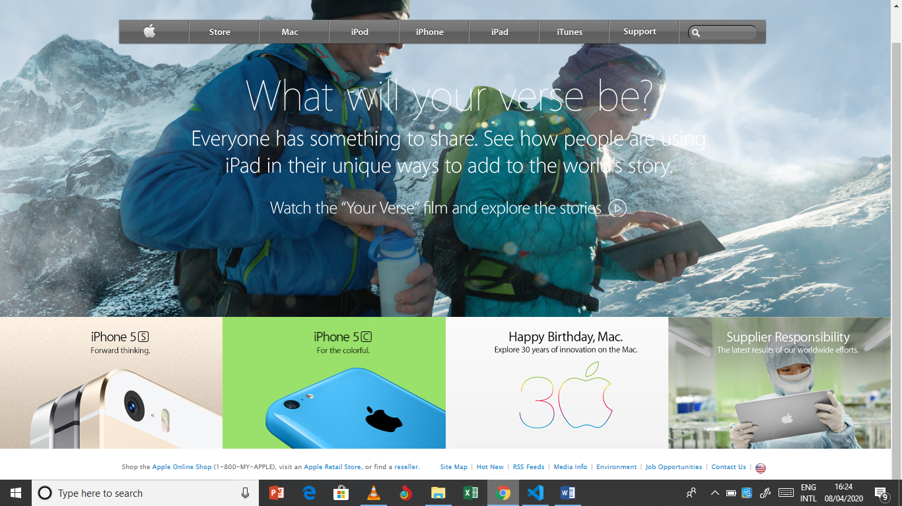

# Clone of old version of apple.com 

This project required to clone the old version of the apple.com page using CSS and HTML while observing set stylelint rules. 

The project required use of gradient backgrounds and a variety of positioning and display properties. The cloned page was built using block, grid, flex, inline-block display properties with a mix of relative and absolute positioning property values. The cloned page is structured into four sections which include; 
- the navigation section (this was positioned to fall within the article section).
- the article section that wraps the big hero image that was positioned to flow into the top, left and right margins of the display screen.
- the aside section that wraps the four images of apple product promotions which were positioned as grid items.(these were built to be links to their respective pages).
- the footer section which has two sections separated by flex display property on their parent container.

## Built With

- HTML,
- CSS,

## Live Demo
[Live Demo Link](https://raw.githack.com/vanheaven-ui/apple-clone/dev-branch/index.html)

## Getting Started.
 To get a local copy up and running follow these simple example steps.

### Prerequisites
- You need a code editor in your local environment.
- You need to have npm installed in your local environment.
### Setup
- (OPTIONAL) Fork the repository into your github repository
- Clone the github repository at [Repo-link](https://github.com/vanheaven-ui/apple-clone) to a desired local envirnment directory.
### Install
- Open the cloned directory with your code editor of choice.
### Usage
- Make any desired changes to the files in the directory and save changes.
### Run tests
- run npm stylelint <stylesheet file name> in your terminal to ensure consistence style.
### Deployment
- Open the index.html file in your browser.

## Authors

👤 **Mworekwa Ezekiel**

- Github: [@githubhandle](https://github.com/vanheaven-ui)
- Twitter: [@twitterhandle](https://twitter.com/MworekwaE)
- Linkedin: [linkedin](https://linkedin.com/in/vanheaven/)
- Email: [Email](vanheaven6@gmail.com)  

## 🤝 Contributing

Contributions, issues and feature requests are welcome!

Feel free to check the [issues page](https://github.com/vanheaven-ui/apple-clone/issues).

## Show your support

Give a ⭐️ if you like this project!

## Acknowledgments

- The Odin project project guidlines and reference materials
- My Microverse standup team.

